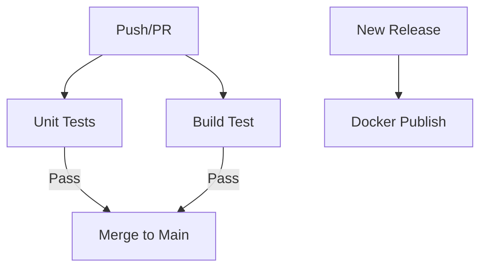

# GitHub Actions Workflows

This directory contains the CI/CD workflows that automate testing, building, and publishing of the Docker image. The workflows are designed to work together to ensure code quality and reliable releases.

## 🔄 Workflow Relationships



## 📋 Setup and Quick Start

> [!IMPORTANT]
> Before using these workflows, you must customize the repository-specific information:
>
> - Replace `KemingHe/strain-seer` with your repository name in all workflow files
> - Update any repository-specific environment variables or secrets
> - Modify the Python version and dependencies as needed for your project

### Prerequisites

1. GitHub repository with Actions enabled
2. GitHub Container Registry (ghcr.io) access

### Required Secrets

- `GITHUB_TOKEN`: Automatically provided by GitHub Actions

## 🔍 Workflow Overview

### 1. Unit Tests (`unit-test.yaml`)

- **Purpose**: Ensures code quality and prevents regressions
- **When**: Runs on every push, pull request, and weekly (Sunday 7:00 UTC)
- **What**:
  - Sets up Python environment with Poetry
  - Runs pytest with coverage reporting
  - Optionally uploads coverage reports to Codecov (code coverage tracking service)
- **Why**:
  - Catch bugs early in development
  - Maintain code quality standards
  - Track test coverage over time

#### **Optional Codecov Integration:**

To remove Codecov (if you don't need coverage tracking):

- Delete the following step from `unit-test.yaml`:

```yaml
- name: Upload coverage reports to Codecov
  uses: codecov/codecov-action@1e68e06f1dbfde0e4cefc87efeba9e4643565303
  with:
    token: ${{ secrets.CODECOV_TOKEN }}
    slug: ${{ github.repository }}
```

- **Pros of Removing Codecov:**
  - Simpler workflow configuration
  - No dependency on external service
  - No need to manage additional secrets

- **Cons of Removing Codecov:**
  - Lose historical coverage tracking
  - No coverage badges for README
  - Less visibility into code quality metrics

### 2. Build Test (`build-test.yaml`)

- **Purpose**: Validates Docker image builds and runtime functionality
- **When**: Runs on every push, pull request, and weekly (Sunday 7:00 UTC)
- **What**:
  - Builds Docker image for multiple platforms (amd64, arm64)
  - Runs end-to-end tests to verify container functionality
  - Validates build process without pushing
- **Why**:
  - Ensure Docker builds work across platforms
  - Verify container runtime behavior
  - Catch build and runtime issues before they reach production

#### **Build Process:**

1. **Multi-Platform Build**
   - Uses Docker Buildx for multi-architecture support
   - Builds for both AMD64 and ARM64 platforms
   - Loads image into local Docker daemon for testing

2. **End-to-End Testing**
   - Starts container in detached mode
   - Verifies container health status
   - Tests Streamlit health endpoint (`/_stcore/health`)
   - Validates main application endpoint
   - Includes proper cleanup of test containers

#### **Test Verification:**

- Container health check (30-second timeout)
- Streamlit health endpoint accessibility
- Main application endpoint accessibility
- Container cleanup verification

**Troubleshooting Build Issues:**

- Check Actions logs for specific error messages
- Verify Dockerfile syntax and dependencies
- Review container logs if health checks fail
- Ensure all required secrets are set

### 3. Docker Publish (`docker-publish.yaml`)

- **Purpose**: Publishes official Docker images to GitHub Container Registry
- **When**: Triggers on new release publication
- **What**:
  - Builds and pushes multi-platform Docker images
  - Generates semantic versioning tags
  - Creates build provenance attestations
- **Why**:
  - Automate release process
  - Ensure consistent image tagging
  - Provide security through provenance

**Security Best Practices:**

- All third-party actions are pinned to specific commit hashes
- Workflows use minimal required permissions
- Build provenance is attested for security
- Actions are pinned to prevent supply chain attacks

**Troubleshooting Publishing:**

- Confirm release tag format (should start with 'v')
- Verify container registry permissions
- Check if the release was properly published
